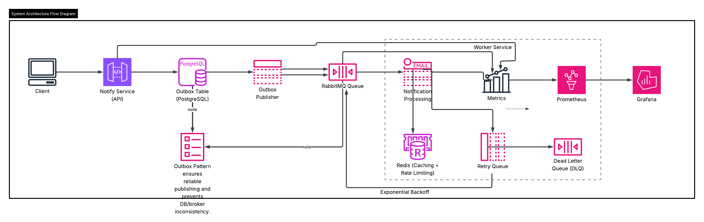

# System Architecture

## Overview

The Distributed Notification System is designed using an **event-driven microservices architecture** to process notifications asynchronously and reliably.

Instead of sending notifications synchronously within the request cycle, the system decouples request ingestion from processing using a **message queue (RabbitMQ)**. This allows the system to handle high throughput while remaining fault tolerant and horizontally scalable.

The architecture implements several distributed system patterns including:

- Outbox Pattern
- Idempotent Consumers
- Retry with Exponential Backoff
- Dead Letter Queues
- Circuit Breaker
- Observability with Metrics

---

## Architecture Diagram

---

## Core Components

### 1. Notify Service (API)

The Notify Service acts as the **entry point** of the system.

Responsibilities:

- Accept notification requests from clients
- Persist notification data in the database
- Store events in the **Outbox Table**
- Ensure idempotent request handling
- Return a job identifier to the client

Notifications are not processed synchronously to avoid blocking client requests.

---

### 2. Outbox Table (PostgreSQL)

The Outbox Table implements the **Transactional Outbox Pattern**.

This pattern guarantees that events are reliably published to the message broker without causing inconsistencies between the database and the messaging system.

Flow:

1. Notification request is stored in the database
2. An event entry is added to the outbox table
3. The publisher later reads this event and publishes it to RabbitMQ

This ensures **exactly-once event publishing at the database level**.

---

### 3. Outbox Publisher

The Outbox Publisher continuously polls the Outbox Table and publishes pending events to RabbitMQ.

Responsibilities:

- Poll unprocessed events
- Publish messages to RabbitMQ
- Mark events as processed

This component ensures reliable message delivery even if the API service crashes after writing to the database.

---

### 4. RabbitMQ (Message Broker)

RabbitMQ acts as the **message broker** that decouples the API service from the worker services.

Responsibilities:

- Queue notification jobs
- Distribute messages to available worker instances
- Support retry queues and dead letter queues

This enables **asynchronous job processing** and allows the system to scale horizontally.

---

### 5. Worker Service

Worker services consume messages from RabbitMQ and process notifications.

Responsibilities:

- Consume notification events
- Process notification delivery
- Handle retry logic
- Implement idempotent message handling
- Record processing metrics

Workers are stateless and can be scaled horizontally to increase throughput.

---

### 6. Retry Queue

If notification processing fails, the message is sent to a **retry queue**.

Retry strategy:

- Exponential backoff
- Limited retry attempts
- Delayed reprocessing

This prevents temporary failures from immediately causing permanent job failures.

---

### 7. Dead Letter Queue (DLQ)

Messages that exceed the maximum retry attempts are routed to the **Dead Letter Queue**.

Responsibilities:

- Store permanently failed messages
- Enable manual inspection
- Allow controlled retries

The DLQ helps prevent problematic messages from blocking the main processing pipeline.

---

### 8. Redis (Caching and Rate Limiting)

Redis is used for two purposes:

Caching  
Notification status may be cached to reduce database load.

Rate Limiting  
Redis enables distributed rate limiting to prevent abuse of the notification API.

---

### 9. Metrics and Observability

The system exposes operational metrics which are collected by **Prometheus**.

Metrics include:

- Queue size
- Notification processing rate
- Retry attempts
- Failure counts
- Processing latency

These metrics are visualized using **Grafana dashboards**, allowing real-time monitoring of system health.

---

## Message Flow

1. Client sends a notification request to the Notify Service.
2. Notify Service stores the request in PostgreSQL and inserts an event into the Outbox Table.
3. The Outbox Publisher reads the event and publishes it to RabbitMQ.
4. RabbitMQ distributes the message to worker services.
5. Workers process the notification.
6. If processing fails, the message is routed to the Retry Queue.
7. After multiple failures, the message moves to the Dead Letter Queue.
8. Metrics are exported to Prometheus and visualized through Grafana.

---

## Scalability

The system supports horizontal scaling through:

- Multiple worker instances
- RabbitMQ load balancing across consumers
- Stateless service design
- Containerized deployment using Docker

Workers can be scaled independently depending on queue workload.

---

## Reliability Mechanisms

The system incorporates several reliability patterns:

Outbox Pattern  
Ensures reliable message publishing.

Retry Mechanism  
Handles transient failures with exponential backoff.

Dead Letter Queue  
Captures permanently failing messages.

Idempotent Consumers  
Prevents duplicate processing.

Circuit Breaker  
Protects the system from cascading failures when external services are unavailable.

---

## Summary

This architecture enables a **highly scalable, fault tolerant notification pipeline** capable of handling large volumes of asynchronous jobs while maintaining system observability and operational reliability.